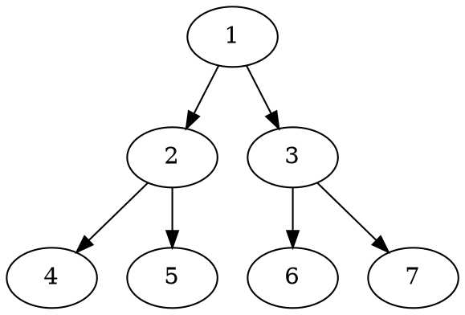

should render demo
.
# h1 Heading 8-)
## h2 Heading
### h3 Heading
#### h4 Heading
##### h5 Heading
###### h6 Heading


## Horizontal Rules

___

---

***

## Typographic replacements


Enable typographer option to see result.

(c) (C) (r) (R) (tm) (TM) (p) (P) +-

test.. test... test..... test?..... test!....

!!!!!! ???? ,,  -- ---

"Smartypants, double quotes" and 'single quotes'


## Emphasis

**This is bold text**

__This is bold text__

*This is italic text*

_This is italic text_

~~Strikethrough~~


## Blockquotes


> Blockquotes can also be nested...
>> ...by using additional greater-than signs right next to each other...
> > > ...or with spaces between arrows.


## Lists

Unordered

+ Create a list by starting a line with `+`, `-`, or `*`
+ Sub-lists are made by indenting 2 spaces:
  - Marker character change forces new list start:
    * Ac tristique libero volutpat at
    + Facilisis in pretium nisl aliquet
    - Nulla volutpat aliquam velit
+ Very easy!

Ordered

1. Lorem ipsum dolor sit amet
2. Consectetur adipiscing elit
3. Integer molestie lorem at massa


1. You can use sequential numbers...
1. ...or keep all the numbers as `1.`

Start numbering with offset:

57. foo
1. bar


## Code

Inline `code`

Indented code

    // Some comments
    line 1 of code
    line 2 of code
    line 3 of code


Block code "fences"

```
Sample text here...
```

Syntax highlighting

``` js
var foo = function (bar) {
  return bar++;
};

console.log(foo(5));
```

``` html_script {id=42}
<script src="https://cdn.jsdelivr.net/npm/mermaid/dist/mermaid.min.js"></script>
<script>mermaid.initialize({startOnLoad:true});</script>
```
## Graphs


``` planetuml
@startuml

[*] --> State1
State1 --> [*]
State1 : this is a string
State1 : this is another string

State1 -> State2
State2 --> [*]

@enduml
```



```ditaa
+--------+   +-------+    +-------+
|        +---+ ditaa +--> |       |
|  Text  |   +-------+    |diagram|
|Document|   |!magic!|    |       |
|     {d}|   |       |    |       |
+---+----+   +-------+    +-------+
  :                         ^
  |       Lots of work      |
  +-------------------------+
```


## Tables

| Option | Description |
| ------ | ----------- |
| data   | path to data files to supply the data that will be passed into templates. |
| engine | engine to be used for processing templates. Handlebars is the default. |
| ext    | extension to be used for dest files. |

Right aligned columns

| Option | Description |
| ------:| -----------:|
| data   | path to data files to supply the data that will be passed into templates. |
| engine | engine to be used for processing templates. Handlebars is the default. |
| ext    | extension to be used for dest files. |


## Links

[link text](http://dev.nodeca.com)

[link with title](http://nodeca.github.io/pica/demo/ "title text!")

Autoconverted link https://github.com/nodeca/pica (enable linkify to see)


## Images


Like links, Images also have a footnote style syntax

![Alt text][id]

With a reference later in the document defining the URL location:

[id]: https://octodex.github.com/images/dojocat.jpg  "The Dojocat"

<h2>Plugins</h2>

### [Subscript](https://github.com/markdown-it/markdown-it-sub) / [Superscript](https://github.com/markdown-it/markdown-it-sup)

- 19^th^
- H~2~O


### [\<ins>](https://github.com/markdown-it/markdown-it-ins)

++Inserted text++


### [\<mark>](https://github.com/markdown-it/markdown-it-mark)

==Marked text==


### [Footnotes](https://github.com/markdown-it/markdown-it-footnote)

Footnote 1 link[^first].

Footnote 2 link[^second].

Inline footnote^[Text of inline footnote] definition.

Duplicated footnote reference[^second].

[^first]: Footnote **can have markup**

    and multiple paragraphs.

[^second]: Footnote text.


### [Definition lists](https://github.com/markdown-it/markdown-it-deflist)

Term **1**

:   Definition 1
with lazy continuation.

Term 2 with *inline markup*

:   Definition 2

        { some code, part of Definition 2 }·

    Third paragraph of definition 2.****

_Compact style:_

Term 1
  ~ Definition 1

Term 2
  ~ Definition 2a
  ~ Definition 2b


### [Abbreviations](https://github.com/markdown-it/markdown-it-abbr)

This is HTML abbreviation example.

It converts "HTML", but keep intact partial entries like "xxxHTMLyyy" and so on.

*[HTML]: Hyper Text Markup Language

### [Custom containers](https://github.com/markdown-it/markdown-it-container)

::: tip
*here be dragons*
:::

!!! note This is the admonition title
This is the admonition body
!!!

.
<h1>h1 Heading 8-)</h1>
<h2>h2 Heading</h2>
<h3>h3 Heading</h3>
<h4>h4 Heading</h4>
<h5>h5 Heading</h5>
<h6>h6 Heading</h6>
<h2>Horizontal Rules</h2>
<hr />
<hr />
<hr />
<h2>Typographic replacements</h2>
<p>Enable typographer option to see result.</p>
<p>© © ® ® ™ ™ § § ±</p>
<p>test… test… test… test?.. test!..</p>
<p>!!! ??? ,  – —</p>
<p>“Smartypants, double quotes” and ‘single quotes’</p>
<h2>Emphasis</h2>
<p><strong>This is bold text</strong></p>
<p><strong>This is bold text</strong></p>
<p><em>This is italic text</em></p>
<p><em>This is italic text</em></p>
<p><s>Strikethrough</s></p>
<h2>Blockquotes</h2>
<blockquote>
<p>Blockquotes can also be nested…</p>
<blockquote>
<p>…by using additional greater-than signs right next to each other…</p>
<blockquote>
<p>…or with spaces between arrows.</p>
</blockquote>
</blockquote>
</blockquote>
<h2>Lists</h2>
<p>Unordered</p>
<ul>
<li>Create a list by starting a line with <code>+</code>, <code>-</code>, or <code>*</code></li>
<li>Sub-lists are made by indenting 2 spaces:
<ul>
<li>Marker character change forces new list start:
<ul>
<li>Ac tristique libero volutpat at</li>
</ul>
<ul>
<li>Facilisis in pretium nisl aliquet</li>
</ul>
<ul>
<li>Nulla volutpat aliquam velit</li>
</ul>
</li>
</ul>
</li>
<li>Very easy!</li>
</ul>
<p>Ordered</p>
<ol>
<li>
<p>Lorem ipsum dolor sit amet</p>
</li>
<li>
<p>Consectetur adipiscing elit</p>
</li>
<li>
<p>Integer molestie lorem at massa</p>
</li>
<li>
<p>You can use sequential numbers…</p>
</li>
<li>
<p>…or keep all the numbers as <code>1.</code></p>
</li>
</ol>
<p>Start numbering with offset:</p>
<ol start="57">
<li>foo</li>
<li>bar</li>
</ol>
<h2>Code</h2>
<p>Inline <code>code</code></p>
<p>Indented code</p>
<pre><code>// Some comments
line 1 of code
line 2 of code
line 3 of code
</code></pre>
<p>Block code “fences”</p>
<ac:structured-macro ac:macro-id="E6aiq" ac:name="code" ac:schema-version="1">
  <ac:parameter ac:name="theme">RDark</ac:parameter>
  <ac:parameter ac:name="linenumbers">false</ac:parameter>
  <ac:parameter ac:name="firstline">0</ac:parameter>
  <ac:parameter ac:name="collapse">false</ac:parameter>
  <ac:plain-text-body>
    <![CDATA[Sample text here...
]]>
  </ac:plain-text-body>
</ac:structured-macro>
<p>Syntax highlighting</p>
<ac:structured-macro ac:macro-id="FdwSl" ac:name="code" ac:schema-version="1">
  <ac:parameter ac:name="theme">RDark</ac:parameter>
  <ac:parameter ac:name="linenumbers">true</ac:parameter>
  <ac:parameter ac:name="language">js</ac:parameter>
  <ac:parameter ac:name="firstline">0</ac:parameter>
  <ac:parameter ac:name="collapse">false</ac:parameter>
  <ac:plain-text-body>
    <![CDATA[var foo = function (bar) {
  return bar++;
};

console.log(foo(5));
]]>
  </ac:plain-text-body>
</ac:structured-macro>
<ac:structured-macro ac:macro-id="42" ac:name="html" ac:schema-version="1">
  <ac:plain-text-body>
    <![CDATA[<script src="https://cdn.jsdelivr.net/npm/mermaid/dist/mermaid.min.js"></script>
<script>mermaid.initialize({startOnLoad:true});</script>
]]>
  </ac:plain-text-body>
</ac:structured-macro>
<h2>Graphs</h2>
<div class="mermaid">
graph TD;
    A-->B;
    A-->C;
    B-->D;
    C-->D;
</div>
<ac:structured-macro ac:macro-id="C2yYY" ac:name="code" ac:schema-version="1">
  <ac:parameter ac:name="theme">RDark</ac:parameter>
  <ac:parameter ac:name="linenumbers">true</ac:parameter>
  <ac:parameter ac:name="language">planetuml</ac:parameter>
  <ac:parameter ac:name="firstline">0</ac:parameter>
  <ac:parameter ac:name="collapse">false</ac:parameter>
  <ac:plain-text-body>
    <![CDATA[@startuml·
[*] --> State1
State1 --> [*]
State1 : this is a string
State1 : this is another string·

State1 -> State2
State2 --> [*]·

@enduml
]]>
  </ac:plain-text-body>
</ac:structured-macro>
</img>
</img>
<h2>Tables</h2>
<table>
<thead>
<tr>
<th>Option</th>
<th>Description</th>
</tr>
</thead>
<tbody>
<tr>
<td>data</td>
<td>path to data files to supply the data that will be passed into templates.</td>
</tr>
<tr>
<td>engine</td>
<td>engine to be used for processing templates. Handlebars is the default.</td>
</tr>
<tr>
<td>ext</td>
<td>extension to be used for dest files.</td>
</tr>
</tbody>
</table>
<p>Right aligned columns</p>
<table>
<thead>
<tr>
<th style="text-align:right">Option</th>
<th style="text-align:right">Description</th>
</tr>
</thead>
<tbody>
<tr>
<td style="text-align:right">data</td>
<td style="text-align:right">path to data files to supply the data that will be passed into templates.</td>
</tr>
<tr>
<td style="text-align:right">engine</td>
<td style="text-align:right">engine to be used for processing templates. Handlebars is the default.</td>
</tr>
<tr>
<td style="text-align:right">ext</td>
<td style="text-align:right">extension to be used for dest files.</td>
</tr>
</tbody>
</table>
<h2>Links</h2>
<p><a href="http://dev.nodeca.com">link text</a></p>
<p><a href="http://nodeca.github.io/pica/demo/" title="title text!">link with title</a></p>
<p>Autoconverted link <a href="https://github.com/nodeca/pica">https://github.com/nodeca/pica</a> (enable linkify to see)</p>
<h2>Images</h2>
<p><br />
</p>
<p>Like links, Images also have a footnote style syntax</p>
<p></p>
<p>With a reference later in the document defining the URL location:</p>
<h2>Plugins</h2>
<h3><a href="https://github.com/markdown-it/markdown-it-sub">Subscript</a> / <a href="https://github.com/markdown-it/markdown-it-sup">Superscript</a></h3>
<ul>
<li>19<sup>th</sup></li>
<li>H<sub>2</sub>O</li>
</ul>
<h3><a href="https://github.com/markdown-it/markdown-it-ins">&lt;ins&gt;</a></h3>
<p><ins>Inserted text</ins></p>
<h3><a href="https://github.com/markdown-it/markdown-it-mark">&lt;mark&gt;</a></h3>
<p><mark>Marked text</mark></p>
<h3><a href="https://github.com/markdown-it/markdown-it-footnote">Footnotes</a></h3>
<p>Footnote 1 link<sup class="footnote-ref"><a href="#fn1" id="fnref1">[1]</a></sup>.</p>
<p>Footnote 2 link<sup class="footnote-ref"><a href="#fn2" id="fnref2">[2]</a></sup>.</p>
<p>Inline footnote<sup class="footnote-ref"><a href="#fn3" id="fnref3">[3]</a></sup> definition.</p>
<p>Duplicated footnote reference<sup class="footnote-ref"><a href="#fn2" id="fnref2:1">[2:1]</a></sup>.</p>
<h3><a href="https://github.com/markdown-it/markdown-it-deflist">Definition lists</a></h3>
<p>Term <strong>1</strong></p>
<p>:   Definition 1<br />
with lazy continuation.</p>
<p>Term 2 with <em>inline markup</em></p>
<p>:   Definition 2</p>
<pre><code>    { some code, part of Definition 2 }·

Third paragraph of definition 2.****
</code></pre>
<p><em>Compact style:</em></p>
<p>Term 1<br />
~ Definition 1</p>
<p>Term 2<br />
~ Definition 2a<br />
~ Definition 2b</p>
<h3><a href="https://github.com/markdown-it/markdown-it-abbr">Abbreviations</a></h3>
<p>This is HTML abbreviation example.</p>
<p>It converts “HTML”, but keep intact partial entries like “xxxHTMLyyy” and so on.</p>
<p>*[HTML]: Hyper Text Markup Language</p>
<h3><a href="https://github.com/markdown-it/markdown-it-container">Custom containers</a></h3>
<p>::: tip<br />
<em>here be dragons</em><br />
:::</p>
<div class="admonition note">
<p class="admonition-title">This is the admonition title</p>
<p>This is the admonition body</p>
</div>
<hr class="footnotes-sep" />
<section class="footnotes">
<ol class="footnotes-list">
<li id="fn1" class="footnote-item"><p>Footnote <strong>can have markup</strong></p>
<p>and multiple paragraphs. <a href="#fnref1" class="footnote-backref">↩︎</a></p>
</li>
<li id="fn2" class="footnote-item"><p>Footnote text. <a href="#fnref2" class="footnote-backref">↩︎</a> <a href="#fnref2:1" class="footnote-backref">↩︎</a></p>
</li>
<li id="fn3" class="footnote-item"><p>Text of inline footnote <a href="#fnref3" class="footnote-backref">↩︎</a></p>
</li>
</ol>
</section>
.
